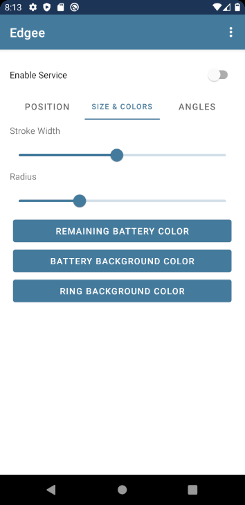
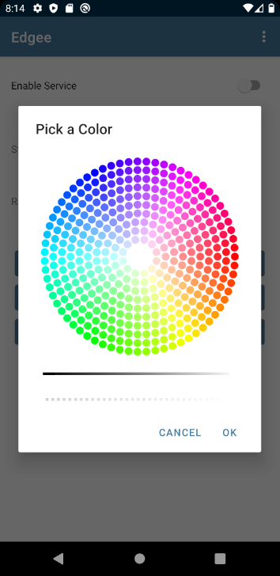
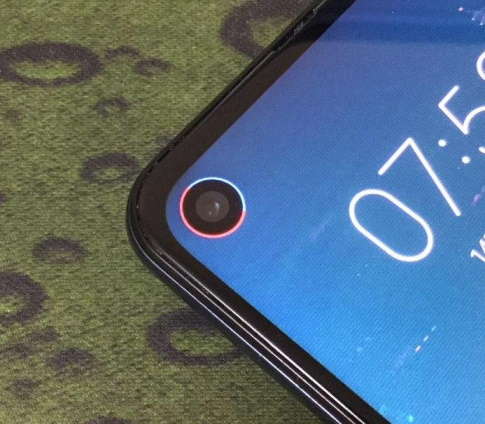

  

# Edgee

Shows the battery level by drawing an arc at an X, Y position.

* A color can be selected for: Battery (Remaining and Background), unused arc. Using [QuadFlask's Color Picker](https://github.com/QuadFlask/colorpicker).
* Start and end angle. For screens with a notch not 100% visible.
* Radius and width to configure the stroke.

# Screens

# Real Device Preview

